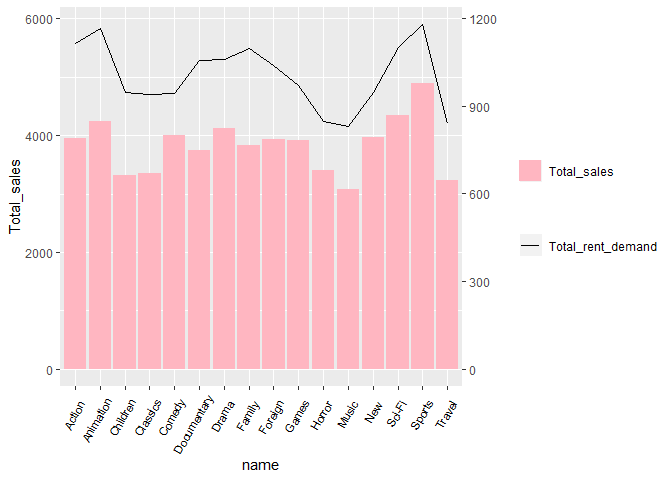
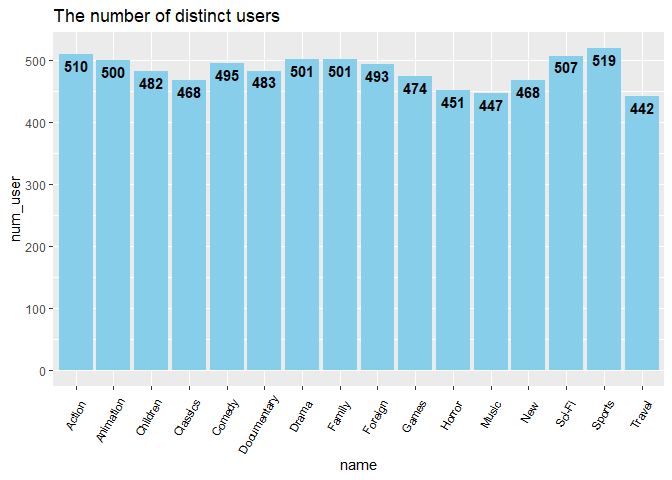
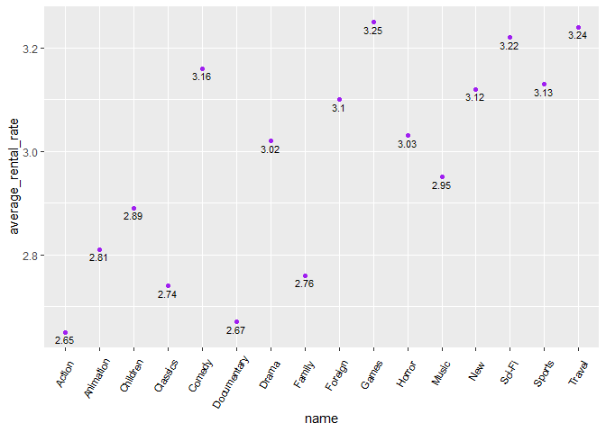
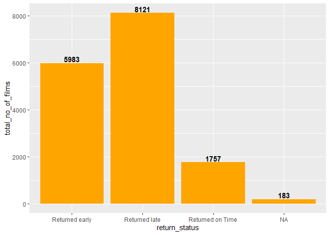
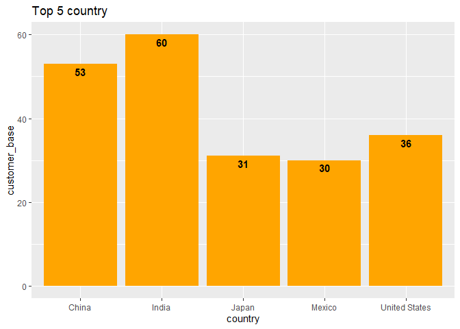

Analyzing DVD rental data with SQL
================
윤정하
11/23/2019

  - [Using query & R language](#using-query-r-language)
      - [Step1. Preparing data](#step1.-preparing-data)
      - [Step2. Analyzing data](#step2.-analyzing-data)

## Using query & R language

### Step1. Preparing data

``` r
library(RPostgreSQL)
library(DBI)

pgdrv <- dbDriver("PostgreSQL")

# 패스워드 가져오기
password<-source("password.R")

#connection 만들기 
con <- dbConnect(pgdrv, dbname="dvd", 
                 port="5432", 
                 user="postgres", 
                 password=password$value,
                 host="localhost")
```

``` r
actor <- dbGetQuery(con, "SELECT * FROM actor")
address <- dbGetQuery(con, "SELECT * FROM address")
category <- dbGetQuery(con, "SELECT * FROM category")
city <- dbGetQuery(con, "SELECT * FROM city")
country <- dbGetQuery(con, "SELECT * FROM country")
customer <- dbGetQuery(con, "SELECT * FROM customer")
film <- dbGetQuery(con, "SELECT * FROM film")
film_actor <- dbGetQuery(con, "SELECT * FROM film_actor")
film_category <- dbGetQuery(con, "SELECT * FROM film_category")
inventory <- dbGetQuery(con, "SELECT * FROM inventory")
language <- dbGetQuery(con, "SELECT * FROM language")
payment <- dbGetQuery(con, "SELECT * FROM payment")
rental <- dbGetQuery(con, "SELECT * FROM rental")
staff <- dbGetQuery(con, "SELECT * FROM staff")
store <- dbGetQuery(con, "SELECT * FROM store")
```

### Step2. Analyzing data

<br>

**Q1. What are the top and least rented (in-demand) genres and what are
their total sales?**

``` r
# table
dbGetQuery(con,"WITH t1 AS (SELECT c.name AS Genre, count(cu.customer_id) AS Total_rent_demand
            FROM category c
            JOIN film_category fc
            USING(category_id)
            JOIN film f
            USING(film_id)
            JOIN inventory i
            USING(film_id)
            JOIN rental r
            USING(inventory_id)
            JOIN customer cu
            USING(customer_id)
            GROUP BY 1
            ORDER BY 2 DESC),
    t2 AS (SELECT c.name AS Genre, sum(p.amount) AS total_sales
            FROM category c
            JOIN film_category fc
            USING(category_id)
            JOIN film f
            USING(film_id)
            JOIN inventory i
            USING(film_id)
            JOIN rental r
            USING(inventory_id)
            JOIN payment p
            USING(rental_id)
            GROUP BY 1
            ORDER BY 2 DESC)
SELECT t1.genre, t1.total_rent_demand, t2.total_sales
FROM t1
JOIN t2
ON t1.genre=t2.genre")
```

    ##          genre total_rent_demand total_sales
    ## 1       Sports              1179     4892.19
    ## 2    Animation              1166     4245.31
    ## 3       Action              1112     3951.84
    ## 4       Sci-Fi              1101     4336.01
    ## 5       Family              1096     3830.15
    ## 6        Drama              1060     4118.46
    ## 7  Documentary              1050     3749.65
    ## 8      Foreign              1033     3934.47
    ## 9        Games               969     3922.18
    ## 10    Children               945     3309.39
    ## 11      Comedy               941     4002.48
    ## 12         New               940     3966.38
    ## 13    Classics               939     3353.38
    ## 14      Horror               846     3401.27
    ## 15      Travel               837     3227.36
    ## 16       Music               830     3071.52

``` r
library(ggplot2)
library(tidyverse)

#graph
tot <- category %>%
  left_join(film_category, by="category_id") %>%
  left_join(film, by="film_id") %>%
  left_join(inventory, by='film_id') %>% 
  left_join(rental, by="inventory_id") %>%
  left_join(customer, by="customer_id") %>%
  left_join(payment, by="rental_id") %>%
  group_by(name) %>%
  summarise(Total_rent_demand = n(), Total_sales = sum(amount,na.rm = T)) %>%
  arrange(desc(Total_rent_demand))

edge <- tot %>% filter(row_number() == 1 | row_number() == n())

tot %>% ggplot(aes(x=name)) + geom_col(aes(y=Total_sales, fill="lightpink")) +
  geom_line(aes(y=Total_rent_demand*5,group = 1,color = 'blackline')) +
  scale_y_continuous(sec.axis = sec_axis(trans = ~ . /5 )) +
  scale_fill_manual('', labels = 'Total_sales', values = "lightpink") +
  scale_color_manual('', labels = 'Total_rent_demand', values = 'black') +
  theme(axis.text.x=element_text(color = "black", size=8, angle=60, vjust=.8, hjust=0.8))
```

<!-- -->

<br>

**Answer**

위의 테이블과 그래프에서 다음과 같은 세가지 인사이트를 얻을 수 있다.

  - Rent A Film 회사는 16개의 장르가 있다.

  - 스포츠 장르에서 가장 많은 횟수의 대여가 일어났다. 그리고 가장 높은 총 매출액을 보였다.

  - 반면, 음악 장르에서 가장 적은 횟수의 대여가 일어났고 가장 낮은 총 매출액을 보였다.

<br> <br>

**Q2. Can we know how many distinct users have rented each genre?**

<br>

``` r
#table
dbGetQuery(con, 'SELECT x.name AS Genre, COUNT(x.name) AS Total_rent_demand FROM (
           SELECT DISTINCT c.name, r.customer_id FROM category c
           INNER JOIN film_category fc ON c.category_id = fc.category_id
           INNER JOIN inventory i ON i.film_id = fc.film_id
           INNER JOIN rental r ON r.inventory_id = i.inventory_id) x 
           GROUP BY x.name
           ORDER BY Total_rent_demand DESC')
```

    ##          genre total_rent_demand
    ## 1       Sports               519
    ## 2       Action               510
    ## 3       Sci-Fi               507
    ## 4        Drama               501
    ## 5       Family               501
    ## 6    Animation               500
    ## 7       Comedy               495
    ## 8      Foreign               493
    ## 9  Documentary               483
    ## 10    Children               482
    ## 11       Games               474
    ## 12         New               468
    ## 13    Classics               468
    ## 14      Horror               451
    ## 15       Music               447
    ## 16      Travel               442

``` r
#graph
user <- category %>%
  inner_join(film_category, by="category_id") %>%
  inner_join(inventory, by="film_id") %>%
  inner_join(rental, by = "inventory_id") %>%
  distinct(name, customer_id) %>%
  group_by(name) %>%
  summarise(num_user = n())

user %>% ggplot() + geom_col(aes(name, num_user),fill="skyblue")+
  geom_text(aes(x=name, y = num_user, label = num_user), fontface = "bold", vjust = 1.4, color = "black", size = 4) +
  labs(title="The number of distinct users") +
  theme(axis.text.x=element_text(color = "black", size=8, angle=60, vjust=.8, hjust=0.8))
```

<!-- -->

<br>

**Answer**

각 장르를 얼마나 많은 고유한 개인이 대여하였는지 알고 싶었다. 흥미롭게도 비록 음악 장르의 총 대여 횟수가 가장 낮았지만,
고유한 개인의 수가 가장 적은 것은 아니었다. 여행 장르의 고유 고객 수가 가장 적었다.

질문 1과 2를 연결지어 생각해보면, 여행 장르는 음악 장르보다 재대여 횟수가 많았다고 볼 수 있다.

당연하게도, 스포츠 장르가 고유 대여 고객 수가 가장 많았다.

<br> <br>

**Q3. What is the average rental rate for each genre? (from the highest
to the lowest)**

``` r
#table
dbGetQuery(con,'SELECT c.name AS genre, ROUND(AVG(f.rental_rate),2) AS average_rental_rate FROM category c 
           INNER JOIN film_category fc ON c.category_id = fc.category_id 
           INNER JOIN film f ON f.film_id = fc.film_id 
           GROUP BY c.name 
           ORDER BY average_rental_rate DESC')
```

    ##          genre average_rental_rate
    ## 1        Games                3.25
    ## 2       Travel                3.24
    ## 3       Sci-Fi                3.22
    ## 4       Comedy                3.16
    ## 5       Sports                3.13
    ## 6          New                3.12
    ## 7      Foreign                3.10
    ## 8       Horror                3.03
    ## 9        Drama                3.02
    ## 10       Music                2.95
    ## 11    Children                2.89
    ## 12   Animation                2.81
    ## 13      Family                2.76
    ## 14    Classics                2.74
    ## 15 Documentary                2.67
    ## 16      Action                2.65

``` r
#graph
rent.r <- category %>%
  inner_join(film_category, by="category_id") %>%
  inner_join(film, by="film_id") %>%
  group_by(name) %>%
  summarise(average_rental_rate = round(mean(rental_rate),2)) %>%
  arrange(desc(average_rental_rate))

rent.r %>% ggplot() + 
  geom_point(aes(x=name, y=average_rental_rate),color="purple") +
  geom_text(aes(x=name,y = average_rental_rate, label = average_rental_rate), vjust = 1.4, color = "black", size = 3) +
  theme(axis.text.x=element_text(color = "black", size=8, angle=60, vjust=.8, hjust=0.8))
```

<!-- -->

<br>

**Answer**

먼저, 카테고리의 총 대여 횟수가 평균 대여료와 관련이 있는지 살펴보았다. 위의 테이블를 보면 둘의 관련이 없다는 사실을 알 수
있다.

비록 게임 장르는 가장 높은 평균 대여료를 보였지만, 대여 횟수에서 중위권에 속하였다. 놀랍게도 음악 장르가 아니라 가장 많은
대여 횟수를 보인 액션 장르가 가장 비쌌다.

이를 통해 대부분의 고객들은 스포츠 관련 영화를 좋아하였고 뮤지컬 영화에는 흥미가 없었다는 사실을 알 수 있다.

<br> <br>

**Q4. How many rented films were returned late, early, and on time?**

``` r
#table
dbGetQuery(con,"WITH t1 AS (SELECT *, DATE_PART('day', return_date-rental_date) AS date_difference FROM rental), 
           t2 AS (SELECT rental_duration, date_difference, 
            CASE 
              WHEN rental_duration > date_difference THEN 'Returned early'
              WHEN rental_duration = date_difference THEN 'Returned on Time'
              ELSE 'Returned late'
            END AS Return_Status
           FROM film f
           JOIN inventory i
           USING(film_id)
           JOIN t1
           USING(inventory_id))
           SELECT Return_status, count(*) AS total_no_of_films
           FROM t2
           GROUP BY 1
           ORDER BY 2 DESC")
```

    ##      return_status total_no_of_films
    ## 1   Returned early              7738
    ## 2    Returned late              6586
    ## 3 Returned on Time              1720

``` r
dbGetQuery(con,"SELECT res.result, COUNT(res.result) FROM (
           SELECT (
           CASE 
           WHEN DATE(rental_date) < DATE(return_date) THEN 'late'
           WHEN DATE(rental_date) = DATE(return_date) THEN 'on time'
           ELSE 'early'
           END) AS result
           FROM rental) res 
           GROUP BY res.result")
```

    ##    result count
    ## 1    late 15756
    ## 2 on time   105
    ## 3   early   183

``` r
#graph
time <- rental %>%
  mutate(date_difference=ceiling(as.numeric(difftime(rental$return_date,rental$rental_date, units = "days")))) %>% 
  select(date_difference, inventory_id) %>% 
  left_join(inventory, by='inventory_id') %>%
  left_join(film, by='film_id') %>% 
  select(rental_duration,date_difference) %>% mutate(return_status=ifelse(rental_duration>date_difference,'Returned early',ifelse(rental_duration==date_difference,'Returned on Time','Returned late'))) %>%
  group_by(return_status) %>% 
  summarise(total_no_of_films=n())

time %>% ggplot() + geom_col(aes(x=return_status,y=total_no_of_films), fill="orange")+
  geom_text(aes(x=return_status, y = total_no_of_films, label=total_no_of_films), fontface = "bold", vjust = -0.2, color = "black", size = 4)
```

<!-- -->

<br>

**Answer**

반납 상태는 DVD 대여 사업에서 주목해야할 가장 중요한 변수 중 하나이다. 영화의 48%는 일찍, 41%는 늦게, 11%는
제시간에 반납되었다.

여러가지 작용 요인이 있을 수 있는데, 예를 들어 고객들의 제어와 전혀 상관없는 상점으로부터의 배송거리 요인 등이 있다. 이를
알기 위해서는 조금 더 분석이 필요해 보인다.

상당 수의 영화가 늦게 반납되는 것에 주목할 필요가 있다. 늦은 반납에 대한 벌금부과가 수입의 원천이 될 수 있고 늦은 반납을
줄일 수 있다. 하지만 여전히, 왜 이러한 문제가 발생하는지 알아야지만 이러한 결정을 내릴 수 있다.

<br> <br>

**Q5. In which countries does Rent A Film have a presence and what is
the customer base in each country? What are the total sales in each
country? (from most to least)**

``` r
#table
dbGetQuery(con, 'SELECT c.country, COUNT(DISTINCT cus.customer_id) AS customer_base, SUM(p.amount) AS total_sale FROM customer cus 
           INNER JOIN address a ON cus.address_id = a.address_id
           INNER JOIN city ct ON a.city_id = ct.city_id
           INNER JOIN country c ON ct.country_id = c.country_id
           INNER JOIN payment p ON p.customer_id = cus.customer_id
           GROUP BY c.country
           ORDER BY total_sale DESC')
```

    ##                                   country customer_base total_sale
    ## 1                                   India            60    6034.78
    ## 2                                   China            53    5251.03
    ## 3                           United States            36    3685.31
    ## 4                                   Japan            31    3122.51
    ## 5                                  Mexico            30    2984.82
    ## 6                                  Brazil            28    2919.19
    ## 7                      Russian Federation            28    2765.62
    ## 8                             Philippines            20    2219.70
    ## 9                                  Turkey            15    1498.49
    ## 10                              Indonesia            14    1352.69
    ## 11                                Nigeria            13    1314.92
    ## 12                              Argentina            13    1298.80
    ## 13                                 Taiwan            10    1155.10
    ## 14                           South Africa            11    1069.46
    ## 15                                   Iran             8     877.96
    ## 16                         United Kingdom             9     850.96
    ## 17                                 Poland             8     786.16
    ## 18                                  Italy             7     753.26
    ## 19                                Germany             7     741.24
    ## 20                                Vietnam             6     676.45
    ## 21                                Ukraine             6     675.53
    ## 22                               Colombia             6     661.54
    ## 23                                  Egypt             6     659.48
    ## 24                              Venezuela             7     632.43
    ## 25                                 Canada             5     559.70
    ## 26                            Netherlands             5     557.73
    ## 27                            South Korea             5     527.77
    ## 28                                  Spain             5     513.80
    ## 29                                  Yemen             4     473.93
    ## 30                               Pakistan             5     473.84
    ## 31                           Saudi Arabia             5     452.94
    ## 32                                   Peru             4     407.01
    ## 33                               Thailand             3     401.08
    ## 34                                 Israel             4     379.13
    ## 35                                Ecuador             3     369.18
    ## 36                             Bangladesh             3     353.19
    ## 37                                Algeria             3     349.18
    ## 38                                 France             4     334.12
    ## 39                               Malaysia             3     330.23
    ## 40                               Tanzania             3     322.22
    ## 41                             Mozambique             3     315.25
    ## 42                   United Arab Emirates             3     305.25
    ## 43                     Dominican Republic             3     304.26
    ## 44                                  Chile             3     303.34
    ## 45                                Austria             3     284.30
    ## 46                                Morocco             3     274.35
    ## 47                               Paraguay             3     273.40
    ## 48                                Belarus             2     271.36
    ## 49                                 Latvia             2     249.43
    ## 50                            Switzerland             3     248.41
    ## 51                                  Kenya             2     245.49
    ## 52                             Yugoslavia             2     233.49
    ## 53                            Puerto Rico             2     224.48
    ## 54                                Romania             2     218.42
    ## 55                                 Runion             1     211.55
    ## 56                       French Polynesia             2     205.52
    ## 57                                 Greece             2     204.54
    ## 58                                  Sudan             2     202.51
    ## 59                             Azerbaijan             2     198.53
    ## 60                               Bulgaria             2     194.52
    ## 61                              Kazakstan             2     192.51
    ## 62                                 Angola             2     187.55
    ## 63                               Cameroon             2     186.49
    ## 64                                Myanmar             2     179.53
    ## 65                               Cambodia             2     179.51
    ## 66                                Bolivia             2     178.56
    ## 67  Congo, The Democratic Republic of the             2     168.58
    ## 68                                   Oman             2     161.56
    ## 69          Holy See (Vatican City State)             1     146.68
    ## 70                                  Nauru             1     143.70
    ## 71                                 Sweden             1     139.67
    ## 72                         Czech Republic             1     132.72
    ## 73                                Moldova             1     127.66
    ## 74                           Turkmenistan             1     126.74
    ## 75                                   Chad             1     122.72
    ## 76                                 Malawi             1     121.73
    ## 77                                 Zambia             1     121.70
    ## 78                   Virgin Islands, U.S.             1     121.69
    ## 79                              Greenland             1     119.72
    ## 80                                Armenia             1     118.75
    ## 81                                 Gambia             1     114.73
    ## 82                                   Iraq             1     111.73
    ## 83                                Hungary             1     111.71
    ## 84                                Bahrain             1     108.76
    ## 85                            North Korea             1     107.71
    ## 86                                 Brunei             1     107.66
    ## 87                                 Kuwait             1     106.75
    ## 88                                Estonia             1     105.72
    ## 89                              Hong Kong             1     104.76
    ## 90                              Sri Lanka             1     103.73
    ## 91                          Liechtenstein             1      99.74
    ## 92                               Anguilla             1      99.68
    ## 93                          French Guiana             1      97.80
    ## 94                          Faroe Islands             1      96.76
    ## 95                                Senegal             1      95.76
    ## 96                                  Nepal             1      93.83
    ## 97                                 Tuvalu             1      93.78
    ## 98                             Madagascar             1      92.79
    ## 99                               Ethiopia             1      91.77
    ## 100                           New Zealand             1      85.77
    ## 101                              Slovakia             1      80.77
    ## 102                               Finland             1      78.79
    ## 103                               Tunisia             1      73.78
    ## 104                           Afghanistan             1      67.82
    ## 105                                 Tonga             1      64.84
    ## 106      Saint Vincent and the Grenadines             1      64.82
    ## 107                             Lithuania             1      63.78
    ## 108                        American Samoa             1      47.85

``` r
#graph
nation<- country %>% 
  left_join(city, by="country_id") %>%
  left_join(address, by="city_id") %>%
  left_join(customer, by="address_id") %>%
  left_join(payment, by="customer_id") %>%
  group_by(country) %>% 
  summarise(customer_base=n_distinct(customer_id),total_sales=sum(amount)) %>% 
  select(country, customer_base, total_sales) %>% 
  arrange(desc(customer_base))

nation %>%  filter(customer_base>29)%>% ggplot() +
  geom_col(aes(x=country,y=customer_base), fill="orange") + 
  labs(title="Top 5 country") + 
  geom_text(aes(x=country, y = customer_base, label=customer_base), fontface = "bold", vjust = 1.4, color = "black", size = 4)
```

<!-- -->

<br>

**Answer**

Rent A Film 회사는 108개의 국가에 존재하고 인도는 60명에 해당하는 가장 많은 고객수와 가장 높은 총매출액을 갖고
있다. 아프가니스탄은 1명이라는 가장 적은 고객 수를 가진 유일한 국가가 아님에도 불구하고 가장 적은 총매출액을 보였다.

<br> <br>

**Q6. Who are the top 5 customers per total sales and can we get their
details just in case Rent A Film wants to reward them?**

``` r
#table
dbGetQuery(con,"WITH t1 AS (SELECT *, first_name || ' ' || last_name AS full_name FROM customer)
SELECT full_name, email, address, phone, city, country, sum(amount) as total_purchase_in_currency
FROM t1
JOIN address
USING (address_id)
JOIN city
USING (city_id)
JOIN country
USING (country_id)
JOIN payment
USING (customer_id)
GROUP BY 1,2,3,4,5,6
ORDER BY 7 DESC
LIMIT 5")
```

    ##        full_name                             email               address
    ## 1   Eleanor Hunt   eleanor.hunt@sakilacustomer.org        1952 Pune Lane
    ## 2      Karl Seal      karl.seal@sakilacustomer.org      1427 Tabuk Place
    ## 3  Marion Snyder  marion.snyder@sakilacustomer.org 1891 Rizhao Boulevard
    ## 4 Rhonda Kennedy rhonda.kennedy@sakilacustomer.org     1749 Daxian Place
    ## 5     Clara Shaw     clara.shaw@sakilacustomer.org   1027 Songkhla Manor
    ##          phone                city       country
    ## 1 354615066969         Saint-Denis        Runion
    ## 2 214756839122          Cape Coral United States
    ## 3 391065549876 Santa Brbara dOeste        Brazil
    ## 4 963369996279           Apeldoorn   Netherlands
    ## 5 563660187896           Molodetno       Belarus
    ##   total_purchase_in_currency
    ## 1                     211.55
    ## 2                     208.58
    ## 3                     194.61
    ## 4                     191.62
    ## 5                     189.60

``` r
DBI::dbDisconnect(con)
```

    ## [1] TRUE

<br>

**Answer**

위의 테이블은 충성 고객의 성명, 주소, 이메일들을 보여준다. 이 정보는 회사의 마케팅팀에게 전해져 그들의 도메인 지식을 사용하여
어떠한 보상을 할지 결정하는데 사용될 수 있다. 이를 통해 그들에게 보상이나 선물들을 보내줄 수 있겠다.

<br> <br>

**결론**

정리하자면, DVD 대여 회사 Rent A Film의 데이터를 분석하여 고객들과 그들의 선호에 대한 인사이트를 찾아보았다. 크게
다음과 같은 3가지 결론을 낼 수 있다.

1.  회사는 스포츠를 사랑하는 고객군을 갖고 있고 음악관련 영화보다 스포츠관련 영화에 더 투자함으로써 총 매출액을 높일 수
    있다. 대여에 있어서 고객들에게 중요한 요소가 아니기에 스포트 장르의 평균 대여료를 높여 총 수입을 높이는 것이
    좋은 아이디어이다. 하지만 이를 확신하기 위해서는 조금 더 분석이 필요하다.

2.  연체료를 총한 추가적인 수입이 가능해보인다.

3.  Rent A Film은 고객과 수입에 있어서 가장 큰 시장인 인도를 비롯하여 108개의 국가에 진출해 있다.추가적으로,
    진출한 국가의 20%가 80%의 고객을 가지고 있다.

<br> <br>

**Reference**

[How I analyzed DVD rental data with
SQL](https://medium.com/free-code-camp/project-1-analyzing-dvd-rentals-with-sql-fd12dd674a64)
